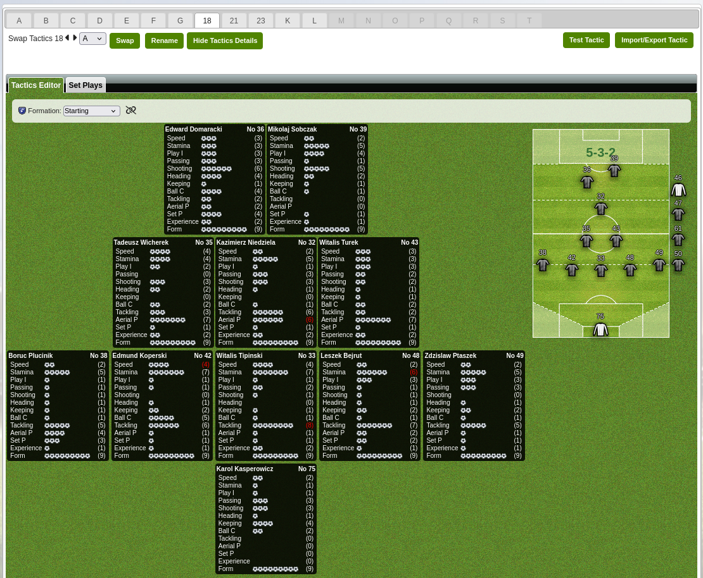

# MZ Tactics Presentation Enhancer (TPE)

## Uwaga

> Skrypt może powodować nieprzewidziane zmiany wizualne. Używaj tylko na własną odpowiedzialność. W razie wystąpienia problemów wyłącz go w menedżerze skryptów i odśwież stronę.

## Funkcje
- Wyświetla szczegóły graczy i kluczowe informacje o zawodnikach obok pola taktyk.

## Instalacja
1. Zainstaluj [Violentmonkey](https://violentmonkey.github.io/) lub inny menedżer skryptów, ten jest open source wiec polecam.
2. Zaimportuj skrypt do menedżera i odśwież stronę.

## Przykładowy zrzut ekranu
Poniżej znajduje się przykład, jak skrypt wygląda w akcji:

  

## Problemy i sugestie
Błędy i sugestie można zgłaszać w zakładce [Issues](https://github.com/fatface007/mz-scripts/issues), nie obiecuję szybkiej odpowiedzi :)

## Licencja
MIT.
